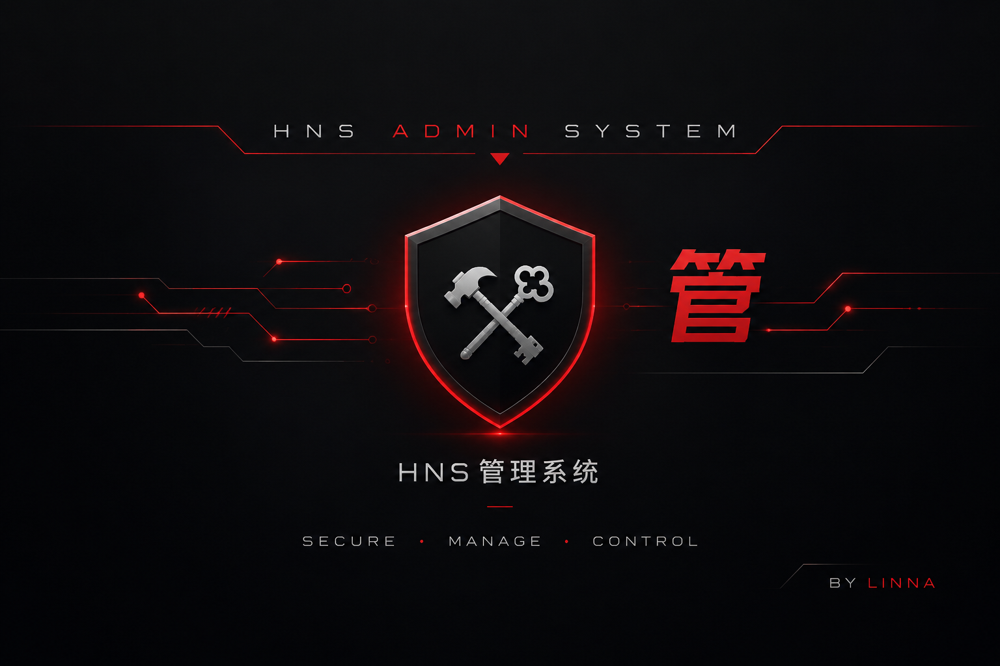

<div align="center">



<br>

# HnsAdminSuite — CS 1.6 封禁 + 权限管理系统

[]()
[]()
[]()
[]()
[]()

> 一款**完全独立**的 Counter-Strike 1.6 封禁 + 权限管理插件。
> 不依赖任何比赛系统，即插即用；封禁与权限发放整合进同一套分级管理菜单。
>
> **维护者 / 联系人：GTRHNS**
>
> Built for the GTR HNS community

</div>

---

## 目录

- [这是什么](#这是什么)
- [项目结构](#项目结构)
- [工作原理：它是怎么触发的](#工作原理它是怎么触发的)
  - [封禁系统](#封禁系统)
  - [权限发放系统](#权限发放系统)
- [分级管理菜单](#分级管理菜单)
- [修复记录（5.0.0）](#修复记录500)
- [技术栈与语言](#技术栈与语言)
- [安装方法](#安装方法)
- [配置文件说明](#配置文件说明)
- [命令列表](#命令列表)
- [未来可扩展方向](#未来可扩展方向)
- [如何二次开发与维护](#如何二次开发与维护)
- [开源协议](#开源协议)

---

## 这是什么

HnsAdminSuite 是一个**独立的封禁 + 权限管理插件**。核心插件 `HnsAdminSuite.sma` 只负责两件事：**让服主能用一套菜单完成封禁管理、权限发放、踢人换图等全部管理操作**，并通过「文件 + PDS」双备份永久记住每个玩家的权限与封禁记录。

它被设计成**完全独立**的插件：

- 不 include 任何比赛系统头文件
- 不依赖比赛系统的 Forward / Native
- 关闭比赛系统它照样工作
- 放到任何 CS1.6 + AMX Mod X 服务器都能跑

| 模块 | 功能 | 是否必须 |
|------|------|----------|
| 封禁系统 | SteamID / IP 封禁、定时 / 永久、自动过期清理 | 必须 |
| 权限发放 | 五级权限在线发放与撤销 | 必须 |
| 管理菜单 | 踢人 / 换图 / 转队 / 重开回合 / 交换队伍 | 必须 |

---

## 项目结构

```
hns-admin-system/
├── HnsAdminSuite.sma   ← 核心插件（封禁 + 权限 + 管理菜单，独立运行）
  ├── compiled/
  │   └── HnsAdminSuite.amxx  ← 预编译产物（开箱即用）
  ├── LICENSE                  ← GPLv3 开源协议
  ├── assets/
  │   └── preview.png          ← 预览图
  └── cstrike/addons/amxmodx/configs/
      ├── permsystem/
      │   ├── perm_list.ini.example      ← 权限名单模板(ini)
      │   ├── ban_list.ini.example       ← 封禁名单模板(ini)
      │   └── perm_config.ini.example    ← 管理密码配置模板(ini)
      └── openhns-prefixes.ini       ← 聊天前缀（服主/管理员/VIP）
```

---

## 工作原理：它是怎么触发的

### 封禁系统

**触发链路（封禁玩家 → 写入名单 → 拒绝进服）：**

```
管理员选择封禁
   │
   ├─→ 弹出封禁时长菜单（1小时 / 1天 / 7天 / 永久）
   │
   ├─→ add_ban() 读取玩家鉴权信息（SteamID 或 IP，正版/盗版都支持）
   │
   ├─→ 写入内存封禁数组 → save_bans_file() 落盘
   │       文件：configs/permsystem/ban_list.ini
   │
   └─→ 立即踢出被封禁玩家
       玩家再次连接 → client_putinserver 触发 check_ban(id)
            └─→ 命中封禁 → 显示剩余时间 + 原因 → 拒绝进服
            └─→ 已过期  → 自动 remove_ban() 清理
```

**关键触发点：**

1. **封禁触发**：管理菜单 → `handlePermBanTime` → `add_ban()`。
2. **进服检测**：`client_putinserver` → `check_ban(id)`。
3. **数据持久化**：封禁写进 `ban_list.ini`，重启服务器不丢。
4. **自动清理**：进服检测时发现过期自动移除，名单不会无限膨胀（上限 `MAX_BANS=512`）。

### 权限发放系统

**触发链路（发放权限 → 授予flag → 永久保存）：**

```
服主打开 /vipadmin
   │
   ├─→ 免密进入（AMXX 最高权限标志 m）或输入管理密码
   │
   ├─→ 选择玩家 → 选择要授予的权限（管理员 / VIP / 清除）
   │
   ├─→ g_iPermLevel[target] = PERM_XXX
   │        ├─→ perm_apply_user_flags() 授予 AMXX flags
   │        └─→ perm_save() 写入内存 + 文件 + PDS 三处
   │
   └─→ 玩家重连 / 重启服务器 → perm_load() 从 PDS / 文件恢复
            └─→ 离线玩家权限不丢失（文件保留历史记录）
```

**关键触发点：**

1. **命令触发**：`say /vipadmin` 打开权限主菜单。
2. **免密进入**：AMXX 服主标志 `m` 玩家免密直接进入。
3. **数据持久化**：权限双备份（文件 + PDS），离线玩家权限不掉。
4. **版本迁移**：`StorageVersion` 自动兼容旧版权限文件。

---

## 分级管理菜单

| 功能 | VIP | 管理员 | 服主 |
|------|:---:|:------:|:----:|
| 踢出玩家 | ✔ | ✔ | ✔ |
| 封禁玩家 | - | ✔ | ✔ |
| 权限发放 | - | - | ✔ |
| 换图 | ✔ | ✔ | ✔ |
| 暂停/恢复比赛 | ✔ | ✔ | ✔ |
| 转移玩家队伍 | ✔ | ✔ | ✔ |
| 重开回合 | - | ✔ | ✔ |
| 交换队伍 | - | ✔ | ✔ |
| 隐藏身份 | - | - | ✔ |

### 权限等级

| 等级 | 常量 | 名称 | AMXX flags |
|------|------|------|-----------|
| 0 | `PERM_NONE` | 普通玩家 | - |
| 1 | `PERM_TEMP` | Helper | `fi` |
| 2 | `PERM_VIP` | VIP | `b` |
| 3 | `PERM_ADMIN` | 管理员 | `defiu` |
| 4 | `PERM_OWNER` | 服主 | `abcdefghijklmnou` |

---

## 修复记录（5.0.0）

本版本为**修复版**，源码头部注释明确列出本次修复共 5 项：

| # | 修复 | 说明 |
|---|------|------|
| 1 | **修复全部乱码为正确中文** | 临时 / 管理员 / 服主等中文显示为乱码的问题 |
| 2 | **密码从硬编码改为 ini 配置** | 原默认密码 `890514` 硬编码在源码中，现改为 `perm_config.ini` 配置，修改立即生效，无需重编译 |
| 3 | **双重认证** | 官方认证（users.ini）+ 密码；非官方输对密码**仅拒绝不封禁** |
| 4 | **存储改 ini 为权威** | `perm_list.ini` / `ban_list.ini` 为唯一权威来源，删除即清除对应数据 |
| 5 | **修复"人人都是服主"漏洞** | 仅官方认证者输对密码才能成为服主，杜绝普通玩家通过任何方式成为服主 |

**其它源码级修复痕迹：**

- `is_official` 判定时序修复：在 `client_authorized` 时捕获，避免被插件 `set_user_flags` 污染。
- 离线玩家权限覆盖丢失修复：`perm_save_file` 先读取现有文件中的全部历史记录（含离线玩家），避免覆盖丢失。
- 旧版本迁移：`StorageVersion` 1→2 时等级 +1，兼容旧权限文件。
- 权限不保存修复：`perm_save` 若 auth 尚未加载则重新获取，避免发放权限后不保存。
- `restart_round` 改用 `sv_restart 1`（`rg_round_restart` 被替换）。

---

## 技术栈与语言

| 项 | 说明 |
|----|------|
| **语言** | Pawn（AMX Mod X 脚本语言，C 风格） |
| **运行环境** | Counter-Strike 1.6 + AMX Mod X 1.9+ |
| **依赖模块** | `amxmodx`、`amxmisc`、`reapi`、`PersistentDataStorage` |
| **编译工具** | `amxxpc`（AMX Mod X 自带编译器） |
| **数据存储** | 文件（`configs/permsystem/`）+ PDS 双备份 |

---

## 安装方法

源码优先，编译后放入服务器（也可直接用 `compiled/` 里的预编译产物）：

```bash
# 1. 编译（把脚本放到 AMXX 的 scripting/ 目录）
amxxpc HnsAdminSuite.sma
```

```bash
# 2. 把生成的 .amxx 复制到 plugins 目录
cp HnsAdminSuite.amxx <cstrike>/addons/amxmodx/plugins/

# 3. 在 plugins.ini 里启用（建议放在较后位置，后加载覆盖其它拦截）
echo "HnsAdminSuite.amxx" >> <cstrike>/addons/amxmodx/configs/plugins.ini
```

```bash
# 4. 复制配置文件（模板去除 .example 后缀）
mkdir -p <cstrike>/addons/amxmodx/configs/permsystem/
cp cstrike/addons/amxmodx/configs/permsystem/perm_list.ini.example \
   <cstrike>/addons/amxmodx/configs/permsystem/perm_list.ini
cp cstrike/addons/amxmodx/configs/permsystem/ban_list.ini.example \
   <cstrike>/addons/amxmodx/configs/permsystem/ban_list.ini
cp cstrike/addons/amxmodx/configs/permsystem/perm_config.ini.example \
   <cstrike>/addons/amxmodx/configs/permsystem/perm_config.ini
cp cstrike/addons/amxmodx/configs/openhns-prefixes.ini \
   <cstrike>/addons/amxmodx/configs/
```

```bash
# 5. 编辑密码配置，上线前务必修改默认密码！
nano <cstrike>/addons/amxmodx/configs/permsystem/perm_config.ini
```

```bash
# 6. 确认模块已启用（必须在 modules.ini 里开启）
echo "reapi" >> <cstrike>/addons/amxmodx/configs/modules.ini
echo "PersistentDataStorage" >> <cstrike>/addons/amxmodx/configs/modules.ini
```

```bash
# 7. 重启服务器或换图生效
amxx plugins   # 确认插件已加载
```

> **注意**：需要 `reapi` 与 `PersistentDataStorage` 两个模块。首次启动会自动创建 `configs/permsystem/` 目录。

---

## 配置文件说明

所有名单文件均以 **ini 为唯一权威来源**，删除即清除对应数据，无需 recompile。

### `perm_config.ini`（管理密码，双重认证核心）

```
; ============================================
;  HNS 管理密码配置 (ini 为权威)
; ============================================
;  此文件是管理密码的唯一权威来源。
;  请修改下面的密码, 上线前务必修改默认密码!
;  密码一经修改立即生效, 无需重新编译插件。
admin_password = 890514
```

### `perm_list.ini`（权限名单）

```
; HNS Admin Suite 权限存储文件 (ini 为权威)
; StorageVersion: 2
; Format: steamid_or_ip name permission_level
; Levels: 0=普通玩家 1=临时 2=VIP 3=管理员 4=服主

STEAM_0:0:916902420 pro 3
```

玩家名含空格时会自动替换为 `_`。文件采用 UTF-8 编码。

### `ban_list.ini`（封禁名单）

```
; HNS Admin Suite 封禁存储文件 (ini 为权威)
; Format: "authid/ip" expire_timestamp "reason"
; expire 0 = permanent

"STEAM_0:1:12345678" 1840000000 "违规行为"
"192.168.1.100" 0 "恶意干扰"
```

### `openhns-prefixes.ini`（聊天前缀）

```
"flag" "m" "[!t服主!d] "
"flag" "d" "[!g管理员!d] "
"flag" "b" "[!tVIP!d] "
```

---

## 双重认证机制

进入权限菜单需同时满足：

1. **官方认证**：玩家已写入 `addons/amxmodx/configs/users.ini`（`is_user_admin` 标记为真）。
2. **管理密码**：输入 `perm_config.ini` 中配置的密码。

- 官方认证服主（`users.ini` 最高权限）输入正确密码后拥有**完整权限**，不受 `perm_list.ini` 限制。
- 非官方认证玩家即使输入正确密码也**仅被拒绝、不会被封禁**，杜绝"人人都是服主"漏洞。
- 普通玩家无法通过任何方式成为服主。

---

## 命令列表

| 命令 | 说明 | 权限 |
|------|------|------|
| `/vipadmin` | 打开权限管理菜单 | 服主 |
| `/permcheck` | 查看自己的权限等级 | 所有人 |
| `/hide` | 服主隐藏/显示身份 | 服主 |

---

## 未来可扩展方向

这套架构刻意做成了"事件驱动 + 双备份持久化"，扩展点非常清晰：

1. **Web 封禁面板**：基于已有的 `ban_list.ini` 格式，可对接数据库做 Web 封禁管理后台。
2. **封禁申诉系统**：被 ban 玩家可留言申诉，服主在菜单中审批。
3. **连坐封禁**：按 IP 段 / 网吧特征封禁，打击小号。
4. **解封倒计时提醒**：封禁到期自动在全服公告，通知玩家可以回归。
5. **权限到期**：给 VIP / 管理员加到期时间，自动降级。
6. **多服同步**：基于 PDS / MySQL 做多服务器封禁与权限同步。
7. **操作日志**：记录所有管理操作（谁封了谁、何时解除），可审计。

---

## 如何二次开发与维护

**开发环境：**

1. 安装 AMX Mod X SDK（含 `amxxpc` 编译器与 `include/` 头文件）。
2. 确保能 include 到 `reapi.inc`、`PersistentDataStorage.inc`。
3. 改完 `.sma` 后编译：`amxxpc HnsAdminSuite.sma`。
4. 在测试服务器 `amxx plugins` 确认加载无报错。

**维护约定：**

- 所有名单都走 `.ini` 文件（ini 为权威来源），不要硬编码封禁/权限数据。
- 管理密码放 `perm_config.ini`，不要写死在源码里。
- 封禁与权限键名统一加前缀（`hns_perm_`、`hns_permip_`），避免冲突。
- 新增可复用函数用 `stock` 声明。
- 改完记得更新模板文件与文档的注释，保持文档与实现同步。

**遇到问题：**

- 插件没加载 → 看 `addons/amxmodx/logs/` 下的错误日志，确认模块是否齐全。
- 权限不保存 → 确认玩家已通过 Steam 验证（SteamID 非空），或检查 `perm_list.ini` 权限。
- 封禁无效 → 确认 `reapi` 模块已装，封禁名单文件编码正确。

---

## 开源协议

本项目基于 **GPLv3** 协议开源，自由使用、修改和分发。

---

**HnsAdminSuite — Admin & Ban System** — Built with passion for the CS 1.6 HNS community.
维护者：**GTRHNS**

---

<div align="center">

### <span style="color:red">⚠️ 严令禁止倒卖插件 ⚠️</span>

<span style="color:red">**本项目为原创独立开发作品，严禁任何形式的倒卖、转售或商业牟利行为！**</span>

<span style="color:red">源码已开源仅供学习交流与个人使用，未经授权不得将其打包、改头换面后用于收费出售、捆绑销售或二次分发获利。</span>

<span style="color:red">**一经发现，将直接追究相关法律责任，并停止后续更新与技术支持。**</span>

<span style="color:#ff8c00">如发现有人倒卖本插件，欢迎向维护者 **GTRHNS** 举报。</span>

</div>
